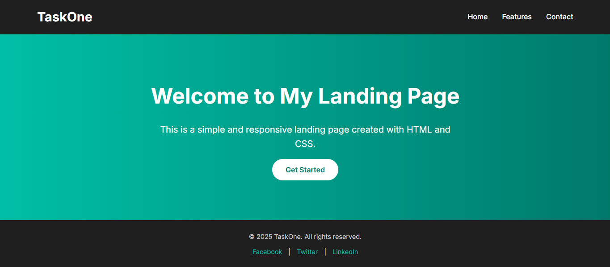

#  Responsive Landing Page

This project is a simple and responsive landing page built using **HTML5** and **CSS3** as part of a web development internship task.

##  Features

- Semantic HTML5 structure
- Clean and modern design
- Responsive layout using Flexbox and media queries
- Header with logo and navigation links
- Hero section with heading, paragraph, and call-to-action button
- Styled footer with social media links
- Mobile-friendly navigation (collapses on smaller screens)

##  Files Included

- `index.html` – Main HTML file containing page structure
- `style.css` – External CSS file for styling and layout
- `README.md` – Project explanation

##  How to Run

1. Open the folder in **VS Code**
2. Make sure the **Live Server extension** is installed
3. Right-click `index.html` and choose **"Open with Live Server"**
4. Resize your browser to test responsiveness

##  Key Concepts Used

- HTML5 Semantic Elements
- CSS Flexbox for layout
- Media Queries for responsiveness
- External styling and clean design principles

 📸 Screenshot

